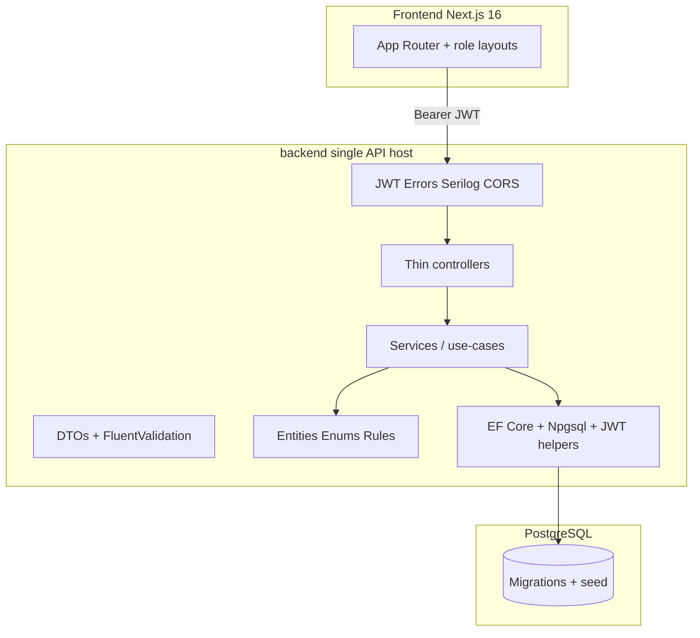

# Assignment & Submission Management System — Phase Plan

**Brief:** OnnoRokom Assistant Software Engineer Recruitment Project  
**Deadline:** 14 August 2026 · **Submit:** https://q-rp.com/c/4CIs  
**Bar:** Not “works.” Evaluator opens repo, runs Docker or README steps, logs in as all three roles, feels production software from a senior hire.

Monorepo: `backend/` (single Web API host) + `frontend/` + root README / `.env.example` / `docker-compose.yml`.

**Backend decision:** One runnable project only — `backend/backend.csproj`. Run with `cd backend && dotnet watch run`. No multi-project Clean Architecture solution. Organize with **folders inside the host**. Optional sibling test project later (Phase 8), never nested under the Api compile tree without excludes.

```text
SchoolManagement(.net)/
├── README.md
├── .env.example
├── docker-compose.yml          # later
├── docs/
├── frontend/                   # Next.js 16
└── backend/                    # ONLY API host
    ├── backend.csproj
    ├── Program.cs
    ├── Controllers/
    ├── Properties/
    ├── appsettings*.json
    ├── Domain/                 # entities, enums (Phase 1+)
    ├── Services/               # use-cases (Phase 2+)
    ├── DTOs/
    ├── Data/                   # DbContext, configs, migrations
    └── ...
```



---

## Brief requirements matrix (PDF → must ship)

Every bullet from the PDF is a hard requirement. Nothing below is optional.

### §2 Admin

| Requirement | Where |
| --- | --- |
| Manage users | Phase 3 — create/update/deactivate, assign role |
| Manage classes/courses and subjects | Phase 3 — CRUD |
| Assign teachers to subjects/classes | Phase 3 — `TeacherAssignment` |
| View all assignments and submissions | Phase 3 — read-only lists + detail |
| Manage application-level settings | Phase 3 — e.g. `AllowLateSubmissions`, display name |

### §2 Teacher

| Requirement | Where |
| --- | --- |
| Create, update, delete assignments | Phase 4 |
| Assign to specific class/course and subject | Phase 4 — ClassId + SubjectId; only if teacher assigned |
| Title, description, deadline, max marks | Phase 4 |
| Publish or keep as draft | Phase 4 — Draft invisible to students |
| View student submissions | Phase 6 |
| Assign marks and provide feedback | Phase 6 |
| Change submission status when necessary | Phase 6 — e.g. Submitted → Graded / Returned |

### §2 Student

| Requirement | Where |
| --- | --- |
| View assignments for their class/course | Phase 5 — enrolled + Published only |
| View assignment details and deadline | Phase 5 |
| Submit an answer | Phase 5 |
| Update submission before deadline if allowed | Phase 5 — allowed until deadline unless graded/locked |
| View status, marks, teacher feedback | Phase 5 / 6 |

### §3 Technical

| Requirement | Approach |
| --- | --- |
| Next.js, React, TypeScript, responsive UI, form validation, API integration | Next.js **latest stable** App Router, Tailwind, Zod + RHF, typed API client |
| ASP.NET Core Web API, C#, REST, validation, error handling, logging, Swagger/OpenAPI | ASP.NET Core **latest stable** (`.NET 10`), FluentValidation, exception middleware, Serilog, OpenAPI JWT |
| PostgreSQL or MongoDB + relationships | **PostgreSQL + EF Core** (relational domain fits); migrations + seed so no manual DDL |
| Login, JWT, role-based authorization | Phase 2 — **enforced on API** (checklist §5) |
| Unit tests: business rules, authorization, submission workflows | Phase 8 — xUnit sibling project referencing `backend` |

### §4 Submission pack

| Deliverable | Plan |
| --- | --- |
| GitHub/GitLab repo link | Public or shared access before submit |
| Frontend + backend + DB files + unit tests | Monorepo complete |
| Migrations, seed/sample data, DB script/backup | EF migrations + seed **and** `docs/db/seed-backup.sql` (or pg_dump) |
| README: overview, features, stack, structure, setup, DB setup, run FE/BE, run tests, assumptions, limitations | Phase 9 template matches PDF verbatim |
| Demo credentials Admin / Teacher / Student | Seeded + README table |
| `.env.example` — no real secrets | Root + documented |
| Easy local setup | README + **Docker Compose one-command** (wow, still must feel easy) |

### §5 Final checklist (gate before submit)

- [ ] Repo accessible  
- [ ] Frontend and backend included  
- [ ] DB creatable from provided files/instructions  
- [ ] Demo accounts for all three roles  
- [ ] README explains run project + tests  
- [ ] **Role-based access enforced by backend API**  
- [ ] Important business rules implemented **and tested**  
- [ ] No real secrets committed  

### §6 Submit

Ship via https://q-rp.com/c/4CIs · issues → hrd@onnorokom.com

---

## Version policy (non-negotiable)

**Always latest stable.** No EOL SDKs, no preview/RC for production path.

| Concern | Policy (as of Aug 2026 — re-check at scaffold) |
| --- | --- |
| .NET / ASP.NET Core | **.NET 10 / ASP.NET Core 10** (`net10.0`) LTS |
| EF Core / Npgsql | Same major as TFM |
| Node.js | Latest Active LTS |
| Next.js / React | `create-next-app@latest` — **Next.js 16.x**, App Router only |
| TS, Tailwind, Zod, RHF, ESLint | `@latest` at install |
| FluentValidation, Serilog, xUnit | Latest stable NuGet for TFM |
| PostgreSQL | Latest stable in Docker image tag |

Install via `dotnet-install.sh --channel 10.0` (avoid broken distro `dotnet-sdk-5.0` paths). Patch-bump everything before Phase 9.

**Forbidden:** fat controllers (business rules belong in Services), EF entities as API response contracts, Pages Router, secrets in git, Mongo without justification (we chose Postgres), nesting extra `.csproj` folders under `backend/` without excludes (breaks `dotnet run`).

---

## Architecture & production standards (single API host)

**One host project:** `backend/backend.csproj`. All HTTP endpoints live here. `cd backend && dotnet watch run` is the only run path.

Organize with folders (same assembly — no multi-project solution):

| Folder | Responsibility |
| --- | --- |
| `Controllers/` | Thin HTTP: auth, map DTOs, call services, return status codes |
| `Domain/` (or `Entities/` + `Enums/`) | Entities, enums, domain exceptions, pure rules |
| `DTOs/` | Request/response contracts for the API |
| `Services/` | Use-case / business logic |
| `Data/` | `DbContext`, Fluent configs, migrations, seed |
| `Auth/` (optional) | JWT helpers, password hashing |
| `Validators/` | FluentValidation validators |

**Separate test project (Phase 8 only):** e.g. repo-level `tests/Backend.Tests/` referencing `backend/backend.csproj` — never place a test `.csproj` inside `backend/` unless `DefaultItemExcludes` is set.

**Rules every phase:** thin controllers · logic in Services/Domain · DTO boundaries · constructor DI · async + `CancellationToken` · FluentValidation · global errors · JWT + resource authz · Serilog (never log secrets) · `IOptions` + env · Fluent configs + migrations · frontend guards with server as source of truth · paginated lists · REST under `/api/...`.

**Default:** plain services registered in `Program.cs` (not MediatR) — clean, not ceremonial.

**Out of scope for structure:** multi-project Domain/Application/Infrastructure classlibs. Folder layering inside the host is enough for this brief.

---

## Documented assumptions (README from day one)

Write these early; refine if needed:

1. One active enrollment model: students enroll in a **Class**; they see Published assignments for enrolled classes only.  
2. Teachers act only on Class+Subject pairs via `TeacherAssignment` (Admin unrestricted for view).  
3. Draft assignments are **hidden from students**; Published are visible.  
4. One submission per student per assignment (unique constraint).  
5. Students may **update** submissions until deadline **unless** status is Graded (then locked).  
6. After deadline: reject create/update by default; if Admin `AllowLateSubmissions` is true, accept and mark **Late**.  
7. Marks must be `0..MaxMarks`; grading sets status to **Graded**.  
8. JWT stored in `localStorage` for SPA simplicity (tradeoff documented).  
9. Answers are **text** (no file upload — out of brief scope).  
10. Delete assignment blocked if any **Graded** submission exists.

---

## Wow tier (PDF §4 optional → we treat as planned excellence)

PDF lists these as optional. We ship them to stand out — **after** must-haves work, but scheduled so they are not last-minute:

| Wow item | Why evaluators notice |
| --- | --- |
| **Docker Compose** (`api` + `web` + `postgres`) | Clone → `docker compose up` → demo |
| **Pagination + advanced filtering** | Lists: search, role/status/class, deadline range, sort |
| **In-app notifications** | Persisted: “assignment published”, “submission graded” — no email required |
| **Role dashboards with signal** | Teacher: pending to grade / due soon; Student: due soon / returned feedback; Admin: counts |
| **Distinctive responsive UI** | Cohesive design system (CSS variables), not generic purple admin chrome; mobile usable |
| **OpenAPI polish** | JWT try-it-out, tagged endpoints, example payloads |
| **CI** | GitHub Actions: `dotnet test` + frontend typecheck/lint on push |
| **DB backup file** | Migrations + seed **and** SQL dump under `docs/db/` |
| **Health + correlation** | `GET /health`; request id in logs/error envelope |
| **Live URL** | Stretch if time; document Swagger URL either way |

**Still out of scope (don’t burn deadline):** file uploads, email/push, realtime chat, multi-tenant, OAuth social, heavy analytics, CQRS theatre.

---

## Phase 0 — Single API host + frontend smoke

**Goal:** Prove toolchain + monorepo: one backend host you run from `backend/`, Next.js up, Health + Swagger work.

- Install .NET 10 SDK; Node Active LTS.  
- **`backend/` = only the Web API project** (`backend.csproj`, `Program.cs`, Controllers, Swagger).  
  - `GET /api/Health` → `{ status: "ok" }`.  
  - Run: `cd backend && dotnet watch run` (no `--project`, no nested classlibs).  
- Do **not** add Domain/Application/Infrastructure/Tests projects under `backend/`.  
- Frontend: `create-next-app@latest` in `frontend/` (TS, Tailwind, App Router); optional `lib/api.ts` → `NEXT_PUBLIC_API_URL`.  
- Root README skeleton (PDF §4 headings), `.env.example`, `.gitignore`, assumptions section.  
- Optional early: empty `docker-compose.yml` stub.

**Exit:** `dotnet build` / `dotnet watch run` from `backend/`; Swagger + Health 200; `npm run dev`; zero feature endpoints beyond Health.

---

## Phase 1 — Domain + database (PDF: relationships + DB files)

**Goal:** Schema evaluators apply with **zero manual DDL** — all inside the single API host.

| Entity | Notes |
| --- | --- |
| `User` | Email (unique), password hash, role, name, IsActive, audit timestamps |
| `Class` | Name, code, academic year |
| `Subject` | Name, code, ClassId |
| `TeacherAssignment` | TeacherId + SubjectId + ClassId (unique combo) |
| `StudentEnrollment` | StudentId + ClassId (unique) |
| `Assignment` | Title, description, deadline, max marks, Draft/Published, ClassId, SubjectId, CreatedByTeacherId |
| `Submission` | AssignmentId, StudentId, answer, submittedAt, status, marks, feedback |
| `AppSetting` | Key/value (or typed row) for admin settings |
| `Notification` | UserId, type, title, body, isRead, createdAt (wow) |

- Add folders under `backend/`: `Domain/` (entities/enums), `Data/` (DbContext, Fluent configs, migrations, seed).  
- Migration + seed: 1 Admin, ≥1 Teacher, ≥2 Students, class/subjects, sample draft+published assignment, one sample submission.  
- Export `docs/db/seed-backup.sql` after seed.  
- Demo passwords only in README / seed (not production secrets).

**Exit:** `dotnet ef database update` (or Compose) creates DB; seed users exist; still a **single** `backend.csproj`.

---

## Phase 2 — Auth (PDF: Login + JWT + RBAC on API)

**Goal:** Login works; **every protected route rejects wrong role at API**.

- `POST /api/auth/login` → JWT (`sub`, `email`, `role`); `GET /api/auth/me`.  
- Policies per role; 401/403 middleware.  
- Frontend login + role redirect (`/admin`, `/teacher`, `/student`); unauthorized UI routes bounce.  
- Prove checklist: Student token calling Admin/Teacher endpoints → **403**.

**Exit:** All three demo accounts log in; RBAC enforced server-side.

---

## Phase 3 — Admin (full §2 Admin)

**Goal:** Admin can configure the whole school from UI.

**APIs → Services:** users CRUD/deactivate/role; classes & subjects CRUD; assign teachers; enroll students; settings; read-only assignments & submissions (paginated + filters).

**UI:** Admin shell — Users, Classes, Subjects, Teacher assignments, Enrollments, Assignments overview, Submissions overview, Settings. Forms validated (Zod).

**Exit:** Fresh Admin can create teacher/student, class, subject, assign teacher, enroll student — no SQL.

---

## Phase 4 — Teacher assignments (full §2 Teacher create path)

**Goal:** Teacher CRUD + draft/publish scoped to their Class/Subject.

- Rules: only assigned Class+Subject; Admin can view all; draft hidden from students; delete blocked if graded submissions.  
- APIs: assignments CRUD + `POST .../publish` (+ unpublish if useful).  
- UI: my assignments, create/edit, draft/published badge, submission count.

**Exit:** Publish → enrolled students see via API; draft does not appear for students.

---

## Phase 5 — Student submissions (full §2 Student)

**Goal:** View → submit → update before deadline → see status.

- Rules: enrolled + Published only; one submission; update until deadline unless Graded; late policy via settings.  
- APIs: student-scoped assignments; `POST/PUT /api/submissions`; `GET .../mine`.  
- UI: list with deadline urgency, detail, submit/edit, status/marks/feedback panel.

**Exit:** publish → submit → Submitted visible to student and teacher.

---

## Phase 6 — Grading (full §2 Teacher review path)

**Goal:** Review, marks, feedback, status changes.

- Rules: only own assignments’ submissions; marks `0..MaxMarks`; grade → Graded; allow Returned/status change when needed.  
- APIs: `GET /api/assignments/{id}/submissions`, `PUT /api/submissions/{id}/grade` (and status).  
- UI: submission table, grade form, feedback.  
- Side effect: create Notification for student (wow).

**Exit:** Student sees marks + feedback; notification appears.

---

## Phase 7 — Quality bar + wow (PDF §3 quality + §4 optionals)

**Goal:** Brief’s validation / errors / logging / Swagger **and** excellence features.

**Must (brief):**

- FluentValidation all writes; error envelope; Serilog + request logging; OpenAPI + JWT scheme; responsive UI; CORS locked to frontend origin.

**Wow (ship):**

- Pagination + filters/sort on major lists  
- Notifications API + bell UI  
- Role dashboard stats  
- `GET /health`  
- Docker Compose: postgres + api (migrate/seed on start) + web  
- Distinctive UI system (variables, hierarchy, motion reserved, mobile)  
- GitHub Actions: test + lint  

**Exit:** Invalid body → 400; full smoke via Swagger; `docker compose up` reaches login.

---

## Phase 8 — Tests (PDF §3 + §5)

**Goal:** Important business rules, authorization, submission workflows — green CI.

Minimum cases:

1. **Authz:** student cannot grade / manage users; teacher cannot manage users; teacher cannot edit another teacher’s class assignment.  
2. **Assignment:** draft excluded from student queries; publish transition.  
3. **Submission:** update before deadline OK; after deadline fails (default); duplicate fails; marks > maxMarks fails.  
4. **Enrollment:** student only sees own class assignments.  
5. **Settings:** late allowed path marks Late (if implemented).

Prefer tests against Services (mocks or EF InMemory/SQLite). Place tests in **`tests/Backend.Tests/`** at repo root (sibling of `backend/`), not nested inside the host. README documents `dotnet test`.

**Exit:** `dotnet test` green locally and in CI.

---

## Phase 9 — Docs + submission pack (PDF §4–§6)

**Goal:** Evaluator success in &lt;15 minutes; checklist §5 all green.

README **must** include (PDF wording):

1. Short project overview  
2. Main features  
3. Technology stack (exact versions)  
4. Project structure (single API host + folder layout + Next.js)  
5. Setup instructions  
6. Database setup (migrate + seed + optional SQL dump)  
7. Run frontend / backend (and Docker) — backend: `cd backend && dotnet run`  
8. Run tests  
9. Assumptions  
10. Known limitations  
11. Demo credentials table (Admin / Teacher / Student)  
12. Swagger URL / optional live URL  

Also: `.env.example`; no secrets; repo public/accessible; submit https://q-rp.com/c/4CIs.

**Exit:** Cold machine path verified once; checklist ticked; submitted.

---

## Build order vs deadline

| When | Phases | Priority |
| --- | --- | --- |
| First | 0–1 | Single API host smoke + DB files |
| Blocks UI | 2 | Auth + API RBAC |
| Unlocks data | 3 | Admin complete |
| Core product | 4–6 | Teacher + Student + grading |
| Stand-out | 7 | Quality + Docker + filters + notifications + UI |
| Proof | 8 | Tests + CI |
| Ship | 9 | README + checklist + q-rp |

**Must-ship for a pass:** Phases 0–6 + §3 quality + §8 tests + §9 docs/checklist.  
**Mind-blowing package:** Phase 7 wow items complete.  
If time collapses: cut live deploy first, then fancy dashboard charts; **never** cut API RBAC, tests, migrations/seed, or README demo accounts.

---

## Out of scope

File uploads, email/SMS push, realtime chat, multi-tenant schools, OAuth social login, advanced BI analytics, MediatR/CQRS, **multi-project Clean Architecture classlibs** (Domain/Application/Infrastructure as separate `.csproj`s).
