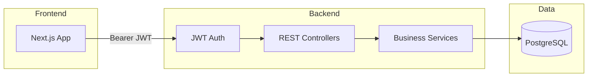

# Assignment and Submission Management System — Phase Plan

Build a role-based school/college app per the recruitment PDF. **Stack defaults:** ASP.NET Core 8+ Web API + Next.js (App Router) + TypeScript + **PostgreSQL + EF Core** (relational domain fits classes/subjects/assignments/submissions) + JWT + xUnit. Monorepo: `backend/` + `frontend/`.



---

## Phase 0 — Project scaffolding and contracts

**Goal:** Runnable empty shells, shared conventions, documented assumptions.

- Create solution: `backend/AssignmentSystem.sln` with projects:
  - `AssignmentSystem.Api` — Web API host
  - `AssignmentSystem.Domain` — entities, enums
  - `AssignmentSystem.Application` — DTOs, interfaces, validators, services
  - `AssignmentSystem.Infrastructure` — EF Core, Identity/JWT, repos
  - `AssignmentSystem.Tests` — xUnit
- Scaffold `frontend/` with Next.js + TypeScript + Tailwind; API client stub (`fetch`/axios) pointing at `NEXT_PUBLIC_API_URL`
- Add root `README.md` skeleton, `.env.example` (API + DB + JWT secret), `.gitignore`
- Document assumptions early (e.g. one student per class; submissions editable until deadline; draft assignments hidden from students)

**Exit:** `dotnet build` and `npm run dev` both start; Swagger loads with no real endpoints yet.

---

## Phase 1 — Domain model and database

**Goal:** Schema + migrations + seed data evaluators can apply without manual DDL.

**Core entities and relationships:**

| Entity | Key fields / notes |
| --- | --- |
| `User` | Email, password hash, role (Admin, Teacher, or Student), name |
| `Class` / `Course` | Name, code, academic year |
| `Subject` | Name, code; linked to class |
| `TeacherAssignment` | Teacher linked to Subject and Class |
| `StudentEnrollment` | Student linked to Class |
| `Assignment` | Title, description, deadline, max marks, status (Draft or Published), ClassId, SubjectId, CreatedByTeacherId |
| `Submission` | AssignmentId, StudentId, answer text, submittedAt, status (Submitted, Late, Graded, or Returned), marks, feedback |

```mermaid
erDiagram
  User ||--o{ StudentEnrollment : enrolls
  Class ||--o{ StudentEnrollment : has
  Class ||--o{ Subject : contains
  User ||--o{ TeacherAssignment : teaches
  Subject ||--o{ TeacherAssignment : assigned
  Class ||--o{ TeacherAssignment : scoped
  User ||--o{ Assignment : creates
  Class ||--o{ Assignment : receives
  Subject ||--o{ Assignment : for
  Assignment ||--o{ Submission : receives
  User ||--o{ Submission : submits
```

- EF Core `DbContext`, Fluent configs, indexes (unique email; unique submission per student+assignment)
- Initial migration + seed: 1 Admin, 1-2 Teachers, 2-3 Students, sample classes/subjects/assignments
- Demo credentials fixed in README (e.g. `admin@demo.local` / `Teacher@123!` pattern — not real secrets)

**Exit:** `dotnet ef database update` creates DB; seed users exist.

---

## Phase 2 — Auth and authorization

**Goal:** Login + JWT + role enforcement on every protected route.

- `POST /api/auth/login` → access token (claims: `sub`, `email`, `role`)
- Optional `GET /api/auth/me` for current user
- ASP.NET policies: `[Authorize(Roles = "Admin")]` etc.; global 401/403 handling
- Frontend: login page, store token in localStorage (document in README), auth guard / middleware by role, redirect to role dashboards

**Exit:** Each role can log in; unauthorized API calls return 403.

---

## Phase 3 — Admin APIs and UI

**Goal:** Admin can manage users, classes/subjects, and teacher assignments.

**APIs (CRUD as needed):**

- Users: list/create/update/deactivate; assign role
- Classes and subjects: CRUD
- Assign teachers to subject/class; enroll students in class
- Read-only: all assignments and submissions (list + detail)
- Simple app settings (e.g. allow late submissions flag)

**UI:** Admin layout — users, classes, subjects, enrollments/assignments overview tables with forms and validation.

**Exit:** Admin can set up a full school structure end-to-end via UI.

---

## Phase 4 — Teacher assignment lifecycle

**Goal:** Teachers create and manage assignments for their classes/subjects.

**Business rules (test these):**

- Teacher may only create/edit assignments for classes/subjects they are assigned to (Admin can view all)
- Draft invisible to students; Published visible to enrolled students
- Fields: title, description, deadline, max marks; publish/unpublish (or draft to published)
- Update/delete with sensible constraints (e.g. block delete if graded submissions exist — document if chosen)

**APIs:** `POST/PUT/DELETE/GET /api/assignments`, `POST .../publish`
**UI:** Teacher dashboard — my assignments, create/edit form, draft vs published badge, submission count.

**Exit:** Teacher publishes an assignment; students in that class can see it via API.

---

## Phase 5 — Student submissions

**Goal:** Students view assignments and submit/update answers before deadline.

**Business rules:**

- Only enrolled students see published assignments for their class
- One submission per student per assignment
- Create submission; update allowed before deadline (and only if not locked/graded — document rule)
- After deadline: reject new/updates (default); mark Late only if Admin setting allows late
- Student can see status, marks, feedback when graded

**APIs:** `GET /api/assignments` (student-scoped), `POST/PUT /api/submissions`, `GET /api/submissions/mine`
**UI:** Student assignment list, detail + deadline, submit/edit form, status/marks/feedback view.

**Exit:** Happy path: publish → submit → student sees Submitted.

---

## Phase 6 — Grading and feedback

**Goal:** Teachers review submissions and grade them.

**Business rules:**

- Teacher sees submissions only for their assignments
- Marks must be `0..MaxMarks`
- Setting marks + feedback sets status to Graded
- Teacher can change status when necessary (e.g. Submitted to Graded)

**APIs:** `GET /api/assignments/{id}/submissions`, `PUT /api/submissions/{id}/grade`
**UI:** Submission list per assignment, grade form, feedback textarea.

**Exit:** Student sees marks and feedback after teacher grades.

---

## Phase 7 — Cross-cutting quality

**Goal:** Production-shaped API behavior and UX polish required by the brief.

- FluentValidation (or DataAnnotations) on all write DTOs
- Consistent error envelope (`message`, `errors[]`, status codes)
- Serilog/ILogger + request logging
- Swagger with JWT bearer scheme documented
- Frontend: responsive layouts, form validation (Zod/React Hook Form), loading/error states
- Pagination on list endpoints with basic `page` / `pageSize`

**Exit:** Invalid payloads return 400; Swagger usable for full manual smoke test.

---

## Phase 8 — Automated tests

**Goal:** Unit tests for important business rules, authz, and submission workflows (brief requirement).

Focus areas in `AssignmentSystem.Tests`:

1. **Authorization:** student cannot grade; teacher cannot manage users; teacher cannot edit another teacher's class assignment
2. **Assignment:** draft not returned to student queries; publish transitions
3. **Submission:** update before deadline OK; after deadline fails; duplicate submission fails; marks greater than maxMarks fails
4. **Enrollment:** student only sees own class assignments

Prefer testing Application services with in-memory/SQLite EF or mocked repos — fast, no Docker required for CI.

**Exit:** `dotnet test` green; README documents the command.

---

## Phase 9 — Docs, seed polish and submission pack

**Goal:** Evaluator can clone → configure → run in under ~15 minutes.

- Complete README: overview, features, stack, structure, setup (Postgres, migrate, seed, run API, run Next, run tests), assumptions, limitations, demo credentials table
- `.env.example` for backend + frontend; no real secrets committed
- Confirm checklist from PDF section 5 (repo access, both apps, DB files, demo accounts, RBAC on API, tests, no secrets)
- Optional stretch (only if time): Docker Compose (`api` + `web` + `postgres`), live deploy URL

**Exit:** Fresh machine path documented; ready for https://q-rp.com/c/4CIs

---

## Suggested build order (calendar)

| Phase | Focus | Rough order |
| --- | --- | --- |
| 0-1 | Scaffold + DB | First |
| 2 | Auth | Blocks all UI |
| 3 | Admin | Unlocks realistic data |
| 4-5 | Assignments + submissions | Core product |
| 6 | Grading | Completes workflows |
| 7-8 | Quality + tests | Parallelize late |
| 9 | README + submit | Last |

Deadline in brief: **14 August 2026** — treat Phases 0-6 as must-ship; 7-8 as required for checklist; Docker/live URL as optional.

---

## Out of scope (unless time remains)

File uploads for answers, email/push notifications, real-time chat, multi-tenant schools, OAuth social login, advanced analytics.
